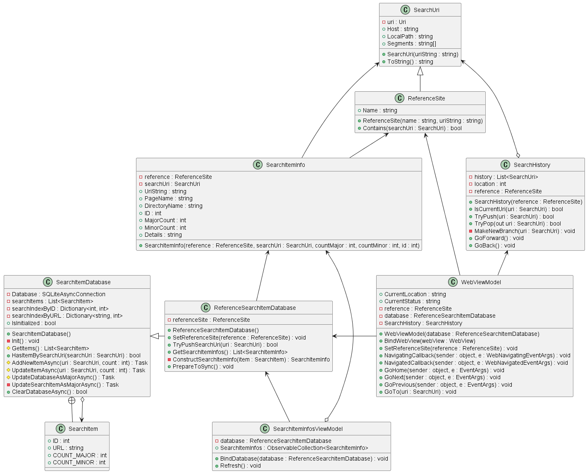

# MauiReferenceBrowserApp

　A browser for .NET MAUI official documentation. The pages viewed are recorded in a database and can be synchronized between smartphone (Android) and PC.

## Files edited
<details>
<summary>Details</summary>
 
 - ReferenceBrowserApp/
     - CustomViews/
         - [SearchItemInfoView.xaml](./ReferenceBrowserApp/CustomViews/SearchItemInfoView.xaml)
         - [SearchItemInfoView.xaml.cs](./ReferenceBrowserApp/CustomViews/SearchItemInfoView.xaml.cs)
     - Data/
         - [ReferenceSearchItemDatabase.cs](./ReferenceBrowserApp/Data/ReferenceSearchItemDatabase.cs)
         - [SearchItemDatabase.cs](./ReferenceBrowserApp/Data/SearchItemDatabase.cs)
     - Models/
         - [ReferenceSite.cs](./ReferenceBrowserApp/Models/ReferenceSite.cs)
         - [SearchHistory.cs](./ReferenceBrowserApp/Models/SearchHistory.cs)
         - [SearchItemInfo.cs](./ReferenceBrowserApp/Models/SearchItemInfo.cs)
         - [SearchUri.cs](./ReferenceBrowserApp/Models/SearchUri.cs)
     - Platforms/
         - Android/
             - [MainActivity.cs](./ReferenceBrowserApp/Platforms/Android/MainActivity.cs)
             - [MainPage.xaml.cs](./ReferenceBrowserApp/Platforms/Android/MainPage.xaml.cs)
             - [NetworkInfoService.cs](./ReferenceBrowserApp/Platforms/Android/NetworkInfoService.cs)
             - [SubPage.xaml.cs](./ReferenceBrowserApp/Platforms/Android/SubPage.xaml.cs)
         - Windows/
             - [MainPage.xaml.cs](./ReferenceBrowserApp/Platforms/Windows/MainPage.xaml.cs)
             - [NetworkInfoService.cs](./ReferenceBrowserApp/Platforms/Windows/NetworkInfoService.cs)
             - [SubPage.xaml.cs](./ReferenceBrowserApp/Platforms/Windows/SubPage.xaml.cs)
     - Services/
         - [DatabaseSyncClientService.cs](./ReferenceBrowserApp/Services/DatabaseSyncClientService.cs)
         - [DatabaseSyncServerService.cs](./ReferenceBrowserApp/Services/DatabaseSyncServerService.cs)
         - [NetworkInfoService.cs](./ReferenceBrowserApp/Services/NetworkInfoService.cs)
     - ViewModels/
         - [SearchItemInfosViewModel.cs](./ReferenceBrowserApp/ViewModels/SearchItemInfosViewModel.cs)
         - [WebViewModel.cs](./ReferenceBrowserApp/ViewModels/WebViewModel.cs)
     - [App.xaml](./ReferenceBrowserApp/App.xaml)
     - [AppShell.xaml.cs](./ReferenceBrowserApp/AppShell.xaml.cs)
     - [Constants.cs](./ReferenceBrowserApp/Constants.cs)
     - [MainPage.xaml](./ReferenceBrowserApp/MainPage.xaml)
     - [MainPage.xaml.cs](./ReferenceBrowserApp/MainPage.xaml.cs)
     - [MauiProgram.cs](./ReferenceBrowserApp/MauiProgram.cs)
     - [SubPage.xaml](./ReferenceBrowserApp/SubPage.xaml)
     - [SubPage.xaml.cs](./ReferenceBrowserApp/SubPage.xaml.cs)
 - uml/
     - [ReferenceBrowser.puml](./uml/ReferenceBrowser.puml)
</details>

## UML (Partial)

[Source](./uml/ReferenceBrowser.puml)

<details>
<summary>UML exported by PUML</summary> 


</details>


## What I learnt from this project

- How to control WebView
- How to write the Resource Dictionary
- How to use the OnPlatform extension
- How to transit Pages
- How to work with SQLite
- How to handle Socket Communication
- How to store the user settings by using Preferences


### User settings

When App have any state to be managed for users (ex., Dark/Light mode), there is a way to store such user settings via Preferences class.

Set
``` csharp
// Store app state
Preferences.Default.Set("Primary", e.Value);
```

Get
``` csharp
// Restore app state
PrimarySwitch.IsToggled = Preferences.Default.Get<bool>("Primary", false);
``` 
